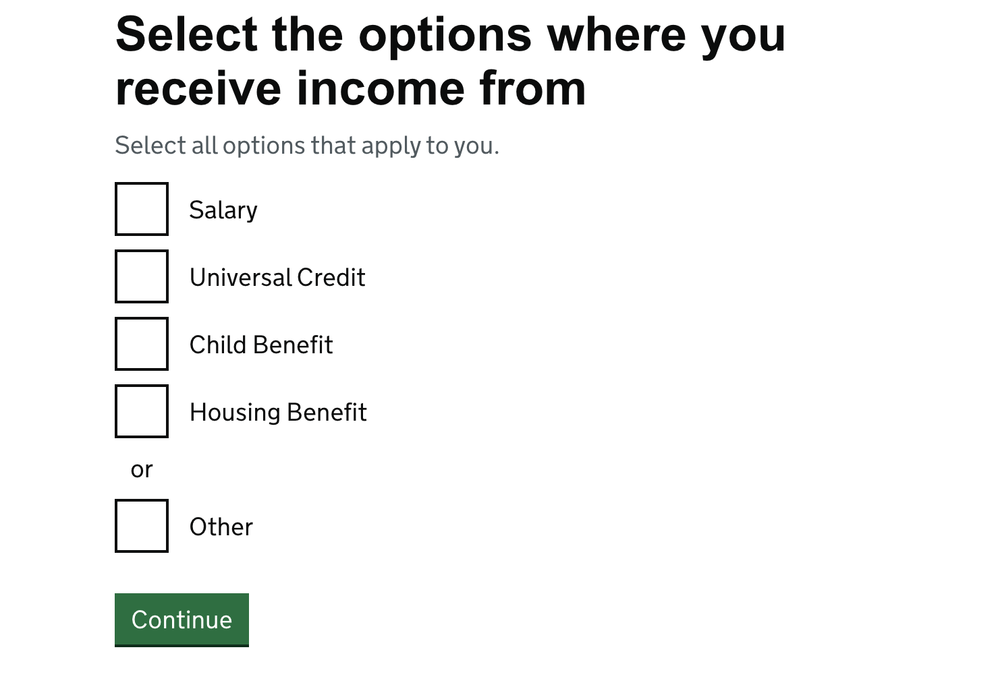
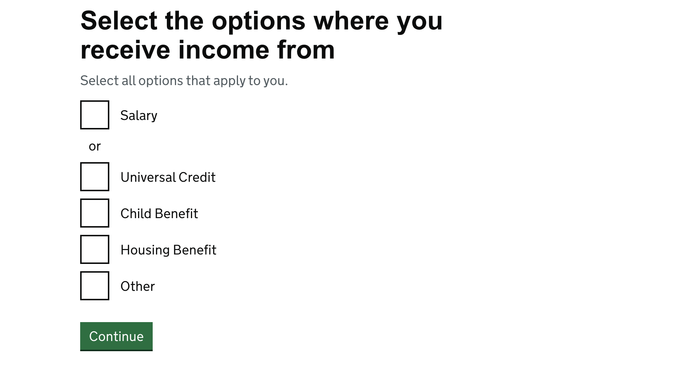
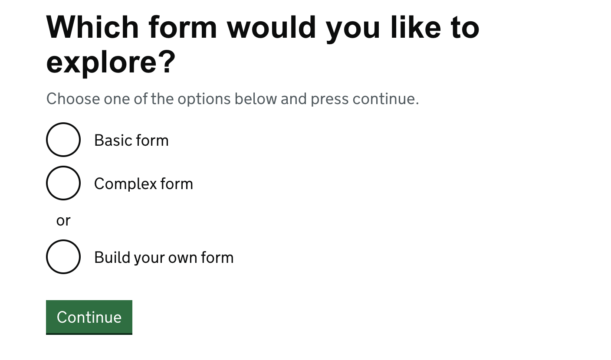
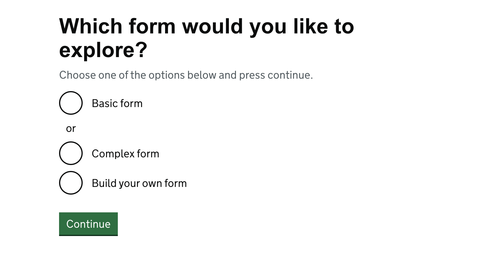

This is a basic documentation page to illustrate changes. At time of writing, it is recommended to compare a repository
without a non-gov implementation in HOF.In future this will not be necessary. In order to update your project 
you will require access to these following urls for documentation/guidance provided.


<br>

```toc
# This code block gets replaced with the Table Of Contents
```

## Useful links
- [Gov UK Design System and Documentation](https://design-system.service.gov.uk)
- [Github - Example Implementation for ETA](https://github.com/UKHomeOffice/eta/pull/81)


## Package.json updates

- Specify package to use `hof@24.0.0`
- Remove `govuk-frontend` in package.json
- Change the engine to support multiple versions of node

```js:title=engine-block.js
  "engines": {
    "node": ">=20.19.0 <21.0.0"
  },
```
- Make dev use the .env file (command varies on projects)
```js:title=basic-dev-cmd.js
"dev": "NODE_ENV=development hof-build watch --env"
```

Ensure you have imported hof frontend themes at the beginning of your app.scss file.
```
@import "hof/frontend/themes/gov-uk/styles/govuk";
```

## Run the application and start comparing 

Note down any broken pages/not similar then refer to the govuk documentation to specify the correct classnames. After 
finishing run your `acceptance tests` to fix any classnames.

```text
 Use chromes "Copy selector" functionality to update acceptance tests faster
``` 

## Troubleshooting:
### 1. Build errors relating to css:

**Example 1:**
```
Error: Undefined mixin.
   ╷
87 │   @include phase-banner(beta);
   │   ^^^^^^^^^^^^^^^^^^^^^^^^^^^ 
```   

**Example 2:**
 ```
Error: The target selector was not found.
Use "@extend .list !optional" to avoid this error.
   ╷
87 │   @extend .list;
   │   ^^^^^^^^^^^^^
   ╵
```

Such selectors are from frontend toolkit which not compatible with the latest version of govuk-frontend and has been removed from hof. To resolve, use the govuk equivalents. If the class names can be added directly to the raw HTML or nunjucks component this is preferred, otherwise amend the relevant selectors in the app.scss. See below a non-exhaustive comparative guide:

| OLD Frontend toolkit/deprecated govuk frontend format     | NEW Govuk Frontend format |
|-----------------------------------------------------------|---------------------------|
| .phase-banner {<br>@include phase-banner(beta);<br>}	    | Remove completely this is now automatic from the govuk-frontend and hof |
| $error-colour;	                                          | govuk-functional-colour(error) |
| visuallyhidden	                                          | govuk-visually-hidden |
| visuallyhidden (If the element is focusable e.g. a link)  | govuk-visually-hidden-focusable |
| @include core-19	                                        | @include govuk-font(19) |
| @include core-16	                                        | @include govuk-font(16) |
| $gutter	                                                  | $govuk-gutter, only use for the gaps in between grid columns, otherwise use the spacing scale. |
| $gutter-half	                                            | $govuk-gutter-half, only use for the gaps in between grid columns, otherwise use the spacing scale. |
| @include bold-19	                                        | @include govuk-font(19, $weight: bold) |
| @include bold-24	                                        | @include govuk-font(24, $weight: bold) |
| @include media(desktop)	                                  | @include govuk-media-query($from: desktop) <br> @include govuk-media-query($until: desktop) |
| @include media(tablet)	                                  | @include govuk-media-query($from: tablet) <br> @include govuk-media-query($until: tablet)	|
| @include media(mobile)                                    | @include govuk-media-query($from: mobile) <br> @include govuk-media-query($until: mobile)	|
| @include ie(6)                                            | Remove completely |
| @include device-pixel-ratio($ratio: 2)	                  | @include govuk-device-pixel-ratio($ratio: 2) |
| form-group	                                              | govuk-form-group |
| form-hint	                                                | Specific to component, for example govuk-label__hint |
| form-label	                                              | Specific to component, for example govuk-label, govuk-radios__label |
| form-label-bold	                                          | govuk-label--s |
| .list	                                                    | .govuk-list |
| .list-bullet	                                            | .govuk-list--bullet |
| .list-number	                                            | .govuk-list--number |
| .grid-row	                                                | .govuk-grid-row |
| .column-full	                                            | .govuk-grid-column-full |
| .column-one-half	                                        | .govuk-grid-column-one-half |
| .column-one-third	                                        | .govuk-grid-column-one-third |
| .column-two-thirds	                                      | .govuk-grid-column-two-thirds |
| .column-one-quarter	                                      | .govuk-grid-column-one-quarter |
| .text                                                     | .govuk-body     |	

Deprecated: Variables for applied colours are deprecated. Please use the `govuk-functional-colour` function instead:	

| OLD Frontend toolkit/deprecated govuk frontend format     | NEW Govuk Frontend format |
|-----------------------------------------------------------|---------------------------|
| $govuk-error-colour                                       | govuk-functional-colour(error) |
| $govuk-success-colour                                     | govuk-functional-colour(success) |
| $govuk-border-colour                                      | govuk-functional-colour(border) |
| $govuk-input-border-colour                                | govuk-functional-colour(input-border) |
| $turquoise                                                | This has been seen for styling alerts but should be replaced with the correct govuk classes for alerts in the raw HTML if using custom template as the govuk styling and colours for alerts have now been updated. Govuk typically uses alerts styling in the following: <br> - GOV.UK Panel component (for confirmations) <br> - GOV.UK Notification banner (for messages) |
| $white                                                    | govuk-colour(“white")| 
| $grey-2                                                   | govuk-colour("black", $variant: "tint-80") |
| govuk-colour("dark-grey")                                 | govuk-colour("black", $variant: "tint-10”) 
| govuk-colour(“mid-grey")                                  | govuk-colour("black", $variant: "tint-80") |
| govuk-colour(“light-grey")                                | govuk-colour("black", $variant: "tint-95”) |
If you come across any css errors on build that have not been covered in this list, refer to the govuk frontend migration notes and sass api reference for further information:
- https://frontend.design-system.service.gov.uk/v4/migration-reference/
- https://frontend.design-system.service.gov.uk/sass-api-reference/

### 2. Lost/incorrect styling in accessible autocomplete typeahead fields
Accessible autocomplete styling has now been added to hof by default. This is to maintain consistency and fix noted styling inaccuracies across services that use accessible autocomplete. Services that use accessible autocomplete can remove the relevant css styling from their app.scss and pull the styling automatically from hof.

### 3. `InitError...Root element ('$root') already initialised` errors in browser logs
Fix this by removing `govuk.initAll` from your client side javascript assets/js/index.js. This is already inistialised in hof.

### 4. `Uncaught ReferenceError: module is not defined` error
This error can be triggered in browser logs if a service calling backend config.js attributes in client side javascript e.g. the service's assets/js/index.js. To resolve, set up a standalone config object in your client side javascript assets/js/index.js and remove `const config = require('../../config.js')` from the file.


## Examples
### Default class names
The following class names are now included for fields by default and should be removed if they have been added to the relevant `className`, `labelClassName` and `formGroupClassName` attribute in the fields config to avoid duplicates:
- govuk-input
- govuk-textarea
- govuk-select
- govuk-radios
- govuk-checkboxes
- govuk-file-upload
- govuk-label
- govuk-form-group

### Changes on NRM
#### Custom Start page

If the start page does not fully take up the page and navigation links are too close the `two-thirds` class then use
use this function

```js:title=index.js
if (window.location.pathname === '/start' || window.location.pathname === '/paper-version-download') {
  $('.govuk-grid-column-two-thirds')
    .eq(1)
    .addClass('govuk-grid-column-full')
    .removeClass('govuk-grid-column-two-thirds');
}
```

### Checkbox group fields
#### Toggling using checkbox group for textarea

For example for custom pages that requires toggling a textarea through a checkbox group. Remove `class="govuk-checkboxes__conditional govuk-checkboxes__conditional--hidden"` from the partials file. Adding these classes is now handled by govuk-frontend automatically and retaining them in the partials file will cause the toggle to not be displayed.

```js:title=fields.js
  'types-of-exploitation-other': {
    mixin: 'checkboxGroup',
    legend: {
      className: 'govuk-visually-hidden'
    },
    options: [{
      value: 'other',
      toggle: 'other-exploitation-details',
      child: 'textarea'
    }]
  },
  'other-exploitation-details': {
    mixin: 'textarea',
    validate: ['required', {type: 'maxlength', arguments: [15000]}],
    legend: {
      className: 'govuk-visually-hidden'
    },
    attributes: [
      {
        attribute: 'rows',
        value: 4
      }
    ],
    dependent: {
      value: 'true',
      field: 'types-of-exploitation-other'
    }
  },
```

with the partial

```nunjucks:title=Partial.njk
<div id="other-exploitation-fieldset">
    {{ renderField("other-exploitation-details") }}
</div>
```
#### New checkbox group features
`checkboxGroup` mixins now have an `exclusive` behaviour option where users can select either one specific option only or multiple from the rest of the group. To configure this you must set the behaviour property for the option to `exclusive`. The exclusive option is separated from the other options using a divider and the text for it is the word ‘or’. 
The divider goes before your exclusive option by default but you can override this by setting the `divider` property for the option in your fields config to ‘after’.

**Default Checkbox Group Divider (before checkbox option):**
```js:title=fields.js
'income-types': {
    isPageHeading: 'true',
    mixin: 'checkboxGroup',
    labelClassName: 'visuallyhidden',
    validate: ['required'],
    options: [
      'salary',
      'universal_credit',
      'child_benefit',
      'housing_benefit'
      { 
        value: 'other',
        behaviour: 'exclusive' // a divider will appear before the option by default
      },
    ]
  },
  ```


<br>

**Checkbox Group Divider (after checkbox option):**

```js:title=fields.js
'income-types': {
    isPageHeading: 'true',
    mixin: 'checkboxGroup',
    labelClassName: 'visuallyhidden',
    validate: ['required'],
    options: [
      { 
        value: 'salary',
        behaviour: 'exclusive',
        divider:'after' // a divider will appear after the option
      },
      'universal_credit',
      'child_benefit',
      'housing_benefit',
      'other'
    ]
  },
```


### Radio group fields
#### Toggling using Radio-box
`Remove class="govuk-radios__conditional govuk-radios__conditional--hidden"` from partials files. Adding these classes is now handled by govuk-frontend automatically and retaining them in partials causes the partial to not not be displayed.
```js:title=field.js
'does-pv-have-children': {
    mixin: 'radioGroup',
    validate: ['required'],
    legend: {
      className: 'govuk-visually-hidden'
    },
    options: [{
      value: 'yes',
      toggle: 'does-pv-have-children-yes-input',
      child: 'partials/does-pv-have-children-yes-amount'
    }, {
      value: 'no'
    }]
  },
```

with partial

```nunjucks:partial.njk
<div id="does-pv-have-children-yes-input">
    {{ renderField("does-pv-have-children-yes-amount") }}
</div>
```


#### New radio group features
`radioGroup` mixins can now have a `divider` set to true and the text for it is the word ‘or’. If set, the divider goes before your option by default but you can override this by setting the divider property for the option in your fields config to ‘after’.

**Radio Group Divider (before radio option):**
```js:title=fields.js
'landing-page-radio': {
    mixin: 'radioGroup',
    validate: ['required'],
    isPageHeading: true,
    options: [
     'basic-form', 
     'complex-form',
     {
       value : 'build-your-own-form', 
       divider: true // a divider will appear before the option
    }]
  },
```


<br>

**Radio Group Divider (after radio option):**
```js:title=fields.js
'landing-page-radio': {
    mixin: 'radioGroup',
    validate: ['required'],
    isPageHeading: true,
    options: [
     {
       value : 'basic-form', 
       divider: 'after' // a divider will appear after the option
     }
     'complex-form',
     'build-your-own-form', 
      ]
  },
```



### Page headings and warnings with Checkboxes and Radio buttons(Single Page Questions)
 Page headings are included in the fieldset for single page questions with checkboxes and radio buttons using `isPageHeading`. To place warning text between the heading and a checkbox/radio button form on such pages, use `isWarning`.

 ```js:title=fields > index.js
 'choose-a-journey': {
    isPageHeading: true,
    isWarning: true,
    mixin: 'radioGroup',
    validate: 'required',
    options: [
      'museums',
      'new-dealer',
      'shooting-clubs',
      'supporting-documents'
    ]
  },
 ```
 `isWarning` can be configured in field/index.js as above. It can also be configured in a behaviour:

 ```js:title=behaviour.js
 module.exports =
  superclass => class extends superclass {
    configure(req, next) {
      if (req.sessionModel.get('activity') === 'renew') {
        Object.keys(req.form.options.fields).forEach(key => {
          req.form.options.fields[key].isWarning = true
        });
      }
      next()
    }
  }
 ```

### Adding warning text using a page template
#### Warning Component

The `warningComponent` macro can be used to display a warning on a page. It takes one parameter:

  - `warning`: The warning text.

**Example usage:**

To add a warning to a page, use text from `warning` set in `pages.${route}.warning`:
```
{
  "test-page": {
    "warning": "This is a warning"
  }
}
```
In your view file:
```


{{ warningComponent(warning) }}
```

Radio and Checkbox fields already include an optional warning component depending on if their `isWarning` field config is set. To set the warning text for such fields, set `warning` in `fields.${field}.warning`:
```
 "test-warn": {
    "legend": "Which test would you like to choose?",
    "hint": "Choose one of the options below and press continue.",
    "options": {
      "test1": {
        "label": "Test 1"
      },
      "test2": {
        "label": "Test 2"
      }
    },
    "warning": "Radio Field Warning"
  },
```


### Adding prefixes and suffixes to an input field in hof

In hof, input text fields use the govukInput nunjucks component which includes options for prefixes and suffixes. An input text field can contain a prefix and a suffix which is displayed below in an example from the sandbox app.

#### How to add prefixes and suffixes to a field within a service

```js:title=fields.js
  income: {
    attributes: [{prefix: '£', suffix: 'per month'}],
  }
```

  

### Clickable validation summary for input-date mixins

When there is an error, if the `field.mixin` is an `input-date` The string `'-day'` is suffixed onto the `key`, which here refers to the field. This is assigned to the `errorLinkId` property which is what allows the validation error summary to link to the field which has the error.

```js:title=controller/controller.js
  _getErrors(req, res, callback) {
    super._getErrors(req, res, () => {
      Object.keys(req.form.errors).forEach(key => {
        if (req.form && req.form.options && req.form.options.fields) {
          const field = req.form.options.fields[key];
          ...
          // get first field for date input control
          else if (field && field.mixin === 'input-date') {
            req.form.errors[key].errorLinkId = key + '-day';
          } else {
            req.form.errors[key].errorLinkId = key;
          }
        }
        ...
      });
      callback();
    });
  }
```

The validation error summary will now be a clickable link which will take the user to the first field if there is an error. This follows the latest govuk design system guidelines except where the date entered cannot be correct (e.g. '13’ in the month field cannot be correct.) and where the date is incomplete (e.g. day, month or year field where the information is missing or incomplete.)  In those two cases the guidelines recommend that the individual field should be highlighted but since hof uses moment js' validator which returns the whole date field as incorrect, our current configuration follows the guidelines.

#### Adding input-date mixin to a field within a service

As shown below in the sandbox application `mixin: 'input-date'` has been added to a date field in fields.js. 

```js:title=fields.js

  'dateOfBirth': dateComponent('dateOfBirth', {
    mixin: 'input-date',
    isPageHeading: 'true',
    validate: [
      'required',
      'date',
      { type: 'after', arguments: ['1900'] }
    ]
  })
```


### Format input text fields
Input text fields for phone numbers, postcodes, town/cities and counties have different sizes to the default input text box. Therefore the corresponding ```className```  attrubute should be added to the fields config where relevant to format the size:
#### Town/City
```js:title=fields.js
townOrCity: {
    validate: ['required', 'notUrl',
      { type: 'regex', arguments: /^([^0-9]*)$/ },
      { type: 'maxlength', arguments: 100 }
    ],
    className: ['govuk-!-width-two-thirds']
  }
```

#### Postcode
```js:title=fields.js
  postcode: {
    validate: ['required', 'postcode'],
    formatter: ['removespaces', 'uppercase'],
    className: ['govuk-input--width-10']
  }
```

#### Phone
```js:title=fields.js
  phone: {
    validate: ['required', 'internationalPhoneNumber'],
    className: ['govuk-input--width-20']
  }
```

#### Disabling input text fields
A `disabled` attribute can be added to input textfields. This false by default but can be set to true in your fields config.
```js:title=fields.js
'first-name': {
    mixin: 'inputText',
    validate: ['required'],
    isPageHeading: true,
    disabled: true
  },
```

### File upload fields
Hof now uses the govukFileUpload component instead of leveraging a standard input text field. This means features like selecting multiple files, disabling file upload fields and using drag and drop functionality are now available for such fields. **Note**: If you have client side javascript set up for file uploads, they may need to be refactored to avoid conflicts with the govuk-frontend field.
#### Selecting multiple files at once
To select multiple files at once, set an attribute of `multiple` with a value of `true`in the fields config:
```js:title=fields.js
'upload-file': {
    mixin: 'inputFile',
    validate: ['required'],
    attributes: [{ attribute: 'multiple', value: true }]
  },
```
#### #### Disabling a file upload field
A `disabled` attribute can be added input file fields. This false by default but can be set to true in your fields config:
```js:title=fields.js
'file-upload': {
    mixin: 'inputFile',
    disabled: true
  },
```
#### Adding javascript functionality to a file upload field e.g. drag and drop functionality
To enable javascript for a file upload field, set the `javascript` attribute to true in the fields config:
```
'file-upload': {
    mixin: 'inputFile',
    javascript: true
  },
```
**Note**: Setting `javascript` to true will cause a visual change from the previous component and might affect existing designs and layouts. See https://design-system.service.gov.uk/components/file-upload/ for more details.

### Adding details component using a page template
#### Details Component
The `detailsComponent` macro can be used to display a details summary and text on a page. It can take three parameters:

  - `details`: An object containing the summary and text to display. The summary is required, but the text is optional.

  - `customSummary`: A string that can be used to override the summary in the details object.

  - `customText`: A string that can be used to override the text in the details object.

  This allows the component to be reused multiple times on the same page with different text.
  
  If `customSummary` or `customText` are not provided, the macro will use the values from the details object. If the details object does not contain a summary or text, it will default to an empty string.

**Example usage:**

Use default summary and text from details object set in `pages.${route}.details`:
```
{
  "test-page": {
    "details":{
      "summary": Details Summary",
      "text": "Details Text",
      "custom-summary": "Custom Summary",
      "custom-text": "Custom Text
    }
  }
}
```
In your view file:
```


{# Default details component #}
{{ detailsComponent(details) }}

{# Set Override arguments - optional #}
 {# This can also be an ordinary string #}
 {# This can also be an ordinary string #}

{# Override just default summary #}
{{ detailsComponent(details, overrideSummary) }}

{# Override both defaultsummary and text #}
{{ detailsComponent(details, overrideSummary, overrideText) }}
```

### Adding a table using a page template
#### Table Component

The `tableComponent` macro can be used to display a table on a page. It takes one parameter:

  - `tableName`: An object containing the following keys:
    - `headers` : an array with the text for each table header
    - `rows`: an array of arrays with the text for each table row
    - `caption`: the table caption (Optional)
    - `firstCellIsHeader`: if set to true, it puts the first element of the each array in the rows array in bold (Optional)
  
**Example usage:**

Set your table object in the relevant `.json` file:
```
"test_table": {
  "headers": [
    "Name",
    "Purpose",
    "Expires"
  ],
  "rows": [
    [
      "seen_cookie_message",
      "Lets us know you’ve already seen our cookie message",
      "1 month"
    ],
    [
      "cookie_preferences",
      "Lets us know that you’ve saved your cookie consent settings",
      "1 month"
    ]
  ],
  "caption": "Table caption" // optional
  "firstCellIsHeader": true // optional
}
```
In your view file:
```


{{ tableComponent(test_table) }}

```
Other variations of a table component in HOF include:

1. `analyticsTableComponent` which takes 4 parameters:
    - `tableName`: as described above in `tableComponent`
    
    The last 3 parameters are related to google analytics:
    - `gaContainerId`
    - `containerIdPurpose`
    - `containerIdExpires`

    **Example usage:**

    In your view file:
    ```
    

    {{ tableComponent(test_table, gaContainerId, containerIdPurpose, containerIdExpires) }}
    ```

2. `cookiesTableComponent` which takes 2 parameters:
    - `tableName` as described above in `tableComponent`
    - `cookieName` - picked from `res.locals.cookieName` which is set to the `session.name`.

    **Example usage:**

    In your view file:
    ```
    

    {{ cookiesTableComponent(test_table, cookieName) }}
    ```

     If `cookieName` is not set you can set a `defaultCookieName` property in the `session_cookies_table` object in cookies.json which will be picked up instead.
    ```
    "session_cookies_table": {
    ...
        "defaultCookieName": "test.sid"
    ...
    }
    ```

### Adding bullet lists using a page template
#### Bullet List Macro

The `bulletList` macro can be used to display a bulleted list on a page. It takes one parameter:

  - `items`: an array with the text for each bullet point

**Example usage:**

Set your list items array in the relevant `.json` file:
```
"bullet_list_example": {
    "items": [
      "item 1",
      "item 2
    ]
  }
```
In your view file:
```


{{ bulletList(bullet_list_example.items) }}
```
