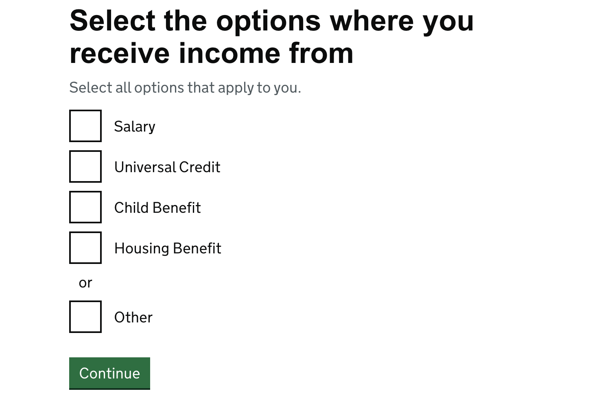
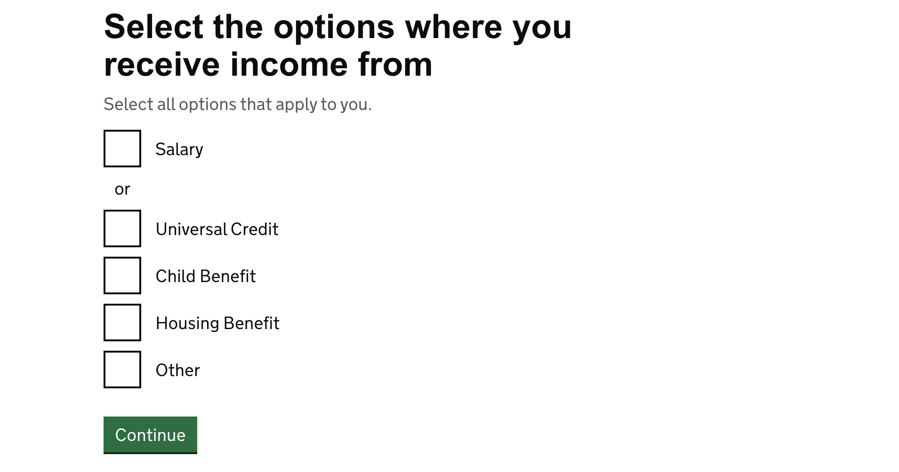
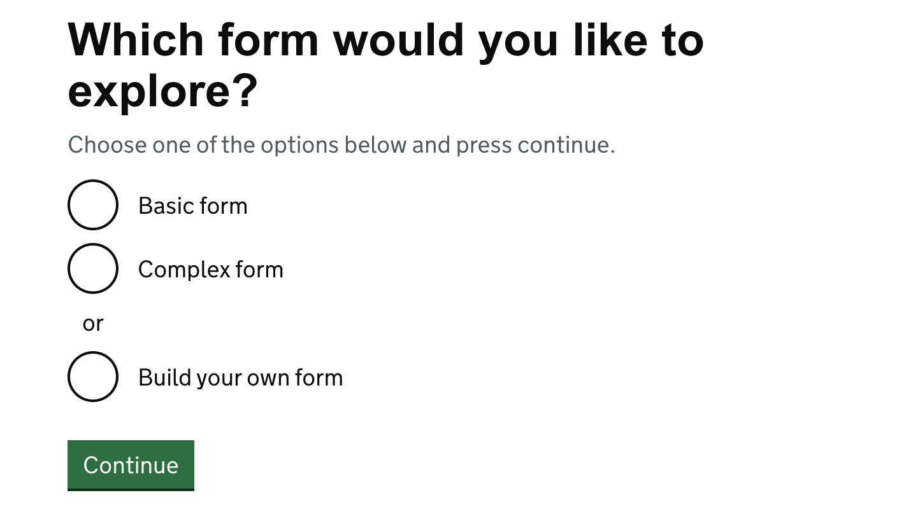
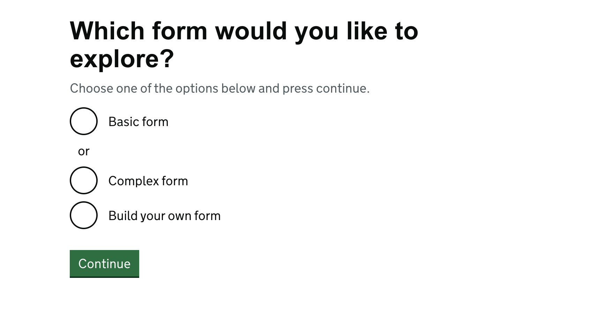

This is a basic documentation page to illustrate changes for converting mustache templates to nunjucks.


<br>

# Contents

1. [Useful links](#useful-links)

2. [Mustache to Nunjucks Quick How-to Guide](#mustache-to-nunjucks-quick-how-to-guide)

3. [Implementing in HOF and HOF Services](#implementing-in-hof-and-hof-services)

## Useful links
- [Gov UK Design System and Documentation](https://design-system.service.gov.uk)
- [Nunjucks Templating Documentation](https://mozilla.github.io/nunjucks/templating.html)
- [Github - Example Implementation for ETA](https://github.com/UKHomeOffice/eta/pull/81)

## Mustache to Nunjucks Quick How-to Guide
**1. Understand the Key Difference**

Mustache is logic-less (very simple, limited features).

Nunjucks supports logic like if, for, filters, etc.

**2. Variables**

Mustache
```
{{name}}
```
Nunjucks
```
{{ name }}
```
These are basically the same. Just add a space (optional but recommended).

**3. Sections (Loops)**

Mustache
```
{{#items}}
  <p>{{name}}</p>
{{/items}}
```
Nunjucks
```

  <p>{{ item.name }}</p>

```
**Changes to note:**
```
{{#items}} → 
```
You must define a loop variable (item)
Use  instead of closing with the same name

**4. Conditionals**

Mustache
```
{{#isLoggedIn}}
  <p>Welcome!</p>
{{/isLoggedIn}}
```
Nunjucks
```

  <p>Welcome!</p>

```
**Changes to note:**
Mustache treats sections as “if truthy”.
Nunjucks uses explicit if.

**5. Inverted Sections (Else / Not)**

Mustache
```
{{^isLoggedIn}}
  <p>Please log in</p>
{{/isLoggedIn}}
```
Nunjucks
```

  <p>Please log in</p>

Or with else:

  <p>Welcome!</p>

  <p>Please log in</p>

```

**6. Templates (Include)**

Mustache
```
{{> header}}
```
Nunjucks
```
 
```
or 
```
 
```
**Changes to note:** Nunjucks requires a file name.

**7. Templates (Extends)**

Mustache
```
{{< header}}
```
Nunjucks
```
 
```
or 
```
 
```

**8. Macros**

A macro is a reusable template function you can call with different values.
Mustache does not use macros it uses 'includes' (`{{> file}}`).

Nunjucks macro example:
- Create a macro:
```

  <button>{{ text }}</button>

```
- Reuse the macro, passing in the desired parameter:
```
{{ button("Save") }}
```

**9. Include vs Macros**

Use `include` for:
- reusing a chunk of HTML/template
- minimal customization needed beyond existing variables
- limited arguments
- minimal logic
*Example*: layouts e.g. headers, footers
Use `macro` for:
- reusable components with parameters
- large amounts of logic or variation
*Example*: components e.g. buttons

**10. Comments**

Mustache
```
{{! This is a comment }}
```
Nunjucks
```
{# This is a comment #}
```

**11. HTML Escaping**

Both escape HTML by default:
```
{{ name }}
```
If you want raw HTML:
Mustache
```
{{{ html }}}
```
Nunjucks
```
{{ html | safe }}
```

**12. Template Inheritance**

Base template
```
<html>
  <body>
    
  </body>
</html>
```
Child template
```


  <p>Hello world</p>

```

**13. Quick Conversion Checklist**

When converting a file:
Replace {{#section}} →  or 
Replace {{/section}} →  or 
Replace {{^section}} → 
Replace {{< partial}} → 
Replace {{> partial}} → 
Replace {{{var}}} → {{ var | safe }}
Replace comments {{! }} → {# #}

**14. Example Conversion**

Mustache
```
{{#users}}
  <p>{{name}}</p>
{{/users}}
{{^users}}
  <p>No users found</p>
{{/users}}
```
Nunjucks
```

  
    <p>{{ user.name }}</p>
  

  <p>No users found</p>

```

## Implementing in HOF and HOF Services

### Package.json updates

- Specify package to use e.g. `hof@24.0.0`

```
- Make dev use the .env file (command varies on projects)
```js:title=basic-dev-cmd.js
"dev": "NODE_ENV=development hof-build watch --env"
```

### Run the application and start comparing 

Note down any broken pages and refer to the govuk design system documentation to change to the correct format.


### Standard Templating Changes

#### Extending templates
Change this mustache format:
```html:title=Test.html
{{< layout}}
<h1>Heading</h1>
{{/layout}}
```
To this nunjucks format:
```html:title=Test.html

<h1>Heading</h1>
```

#### Including templates
Change this mustache format:
```html:title=file.html
{{$validationSummary}}
  {{> partials-validation-summary}}
{{/validationSummary}}
```
To this nunjucks format:
```html:title=file.html

  

```
#### Blocks
Mustache
```html:title=file.html
{{$content}}{{/content}}
```
Nunjucks
```html:title=file.html

```

#### Mixins
Nunjucks reads the `-` in kebab-case variables as subtraction, so mixin names in kebab-case have been changed to camelCase.
e.g. the mixin radio-group is now radioGroup. This format must be updated anywhere the mixin is called
Example
In fields.js change:
```js:title=fields.js
'radio-field': {
    mixin: 'radio-group',
    validate: ['required'],
    options: ['yes', 'no']
  }
```
To:
```js:title=fields.js
'radio-field': {
    mixin: 'radioGroup',
    validate: ['required'],
    options: ['yes', 'no']
  }
```

If a mixin field is rendered in a custom template change this mustache format:
```html:title=file.html
{{#radio-group}}myRadioGroup{{/radio-group}}
```
To this nunjucks format:
```html:title=file.html
{{ radioGroup("myRadioGroup") }}
```
**New features for mixins**

`checkboxGroup` mixins now have an `exclusive` behaviour option where users can select either one specific option only or multiple from the rest of the group. To configure this you must set the behaviour property for the option to `exclusive`. The exclusive option is separated from the other options using a divider and the text for it is the word ‘or’. 
The divider goes before your exclusive option by default but you can override this by setting the `divider` property for the option in your fields config to ‘after’.

**Default Checkbox Group Divider (before checkbox option):**
```js:title=fields.js
'income-types': {
    isPageHeading: 'true',
    mixin: 'checkboxGroup',
    labelClassName: 'visuallyhidden',
    validate: ['required'],
    options: [
      'salary',
      'universal_credit',
      'child_benefit',
      'housing_benefit'
      { 
        value: 'other',
        behaviour: 'exclusive' // a divider will appear before the option by default
      },
    ]
  },
  ```


<br>

**Checkbox Group Divider (after checkbox option):**

```js:title=fields.js
'income-types': {
    isPageHeading: 'true',
    mixin: 'checkboxGroup',
    labelClassName: 'visuallyhidden',
    validate: ['required'],
    options: [
      { 
        value: 'salary',
        behaviour: 'exclusive',
        divider:'after' // a divider will appear after the option
      },
      'universal_credit',
      'child_benefit',
      'housing_benefit',
      'other'
    ]
  },
```


<br><br>

`radioGroup` mixins can now have a `divider` set to true and the text for it is the word ‘or’. If set, the divider goes before your option by default but you can override this by setting the divider property for the option in your fields config to ‘after’.

**Radio Group Divider (before radio option):**
```js:title=fields.js
'landing-page-radio': {
    mixin: 'radioGroup',
    validate: ['required'],
    isPageHeading: true,
    options: [
     'basic-form', 
     'complex-form',
     {
       value : 'build-your-own-form', 
       divider: true // a divider will appear before the option
    }]
  },
```


<br>

**Radio Group Divider (after radio option):**
```js:title=fields.js
'landing-page-radio': {
    mixin: 'radioGroup',
    validate: ['required'],
    isPageHeading: true,
    options: [
     {
       value : 'basic-form', 
       divider: 'after' // a divider will appear after the option
     }
     'complex-form',
     'build-your-own-form', 
      ]
  },
```



`inputFile` mixins now use the govukFileUpload component instead of leveraging a standard input text field. You can add a 'multiple' attribute to the mixin's fields config to enable selecting multiple files at once to upload.
```js:title=fields.js
'upload-file': {
    mixin: 'inputFile',
    validate: ['required'],
    isPageHeading: true,
    attributes: [{ attribute: 'multiple', value: true }]
  },
```

A `disabled` property added to inputText and inputFile mixins. This false by default but can be set to true in your fields config.
```js:title=fields.js
'first-name': {
    mixin: 'inputText',
    validate: ['required'],
    isPageHeading: true,
    disabled: true
  },
```

#### Using Locals and Variables in Lambdas
Change kebab-case variables and res.locals properties to camelCase or snake_case.

Example
Change `test-variable` in this mustache format:
```html:title=file.html
    {{#test-variable}}
      {{< partials-test-file}}
    {{/test-variable}}

```

To this nunjucks format:
```html:title=file.html

  

```
Or this nunjucks format:
```html:title=file.html

  

```
#### Translations
Change this mustache format:
```html:title=file.html
{{#t}}buttons.start-again{{/t}}
```

To this nunjucks format:
```html:title=file.html
{{ t('buttons.start-again') }}
```

#### Unescaping HTML
To unescape HTML, change this mustache format:
```html:title=file.html
{{{content.message}}}
```

To this nunjucks format:
```html:title=file.html
{{ content.message | safe }}
```

#### If/else templating
Change this mustache format:
```html:title=file.html
{{^className}}govuk-input{{/className}}{{#className}}{{className}}{{/className}}
```

To this nunjucks format:
```html:title=file.html
{{ className }}govuk-input
```
#### For Loops templating
Change this mustache format:
```html:title=page.html
{{#fields}}
  {{#renderField}}{{/renderField}}
{{/fields}}
```

To this nunjucks format:
```html:title=file.html

  {{ renderField(field) }}

```
#### Replacing partials with macros

Some reusable partials have been changed to macros. They include:
- details-summary.html
- warn.html
- table.html
- summary-table.html
- bullet-list.html

You can set the text for them in `.json` files as before.

Change this mustache partial:
```html:title=file.html
{{> partials-warn}}
```
To this nunjucks macro:
```html:title=page.html


{{ warningComponent(warning) }}
```

#### GovUK Nunjucks Components
You can now include govuk nunjucks components in your custom templates:
Examples

Default back.html in hof using govuk component
```html:title=Back.html


  
    {{ govukBackLink({
      text: t('buttons.back'),
      href: backLink
    }) }}
  

```

Custom back.html using govuk component
```html:title=Back.html


  
    {{ govukBackLink({
      text: 'Back to start',
      href: /start
    }) }}
  

```
